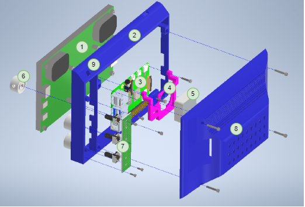

# Hardware

## Part list

Parts not in this list are generic standard components.

Part|Model|link
---|---|---
Adc|ADS1115|[Website](https://www.adafruit.com/product/1085)
Screen|WIMAXIT M728 Raspberry Pi 7” |[Website](https://wimaxit.com/products/wimaxit-raspberry-pi-7-touch-screen-display-monitor-1024x600-usb-powered-hdmi-screen-monitor-ips-178-with-rear-speakers-stand-for-raspberry-4-3-2-laptop-pc?_pos=1&_sid=92c3c533b&_ss=r)
Transistor| BC547|-
Raspberry Pi|Raspberry Pi 4 Model b|[Website](https://www.raspberrypi.com/products/raspberry-pi-4-model-b/)
PCB|-|[Website](https://www.az-delivery.de/products/pcb-board-set-lochrasterplatte-platine-leiterplatte-4x4-stuck)

## Case assembly 

The assembly of the case ist done like showcased in the image. 
The Parts will be referenced by the number in the image.

1. Put the screen (1) in the front pice of the case (2). Put the Bottom in first.
2. Screw the fan (5) from the Back to the fan-bracket (4).
3. Put the Raspberry Pi (3) on the standoffs at the back of the screen.
4. On top of that put the fan (3+4).
5. Screw it to the screen and connect the HDMI- and USB-connectors.
6. Screw the PCBs (7) to the front pice (2).
7. Put the caps (8) on the potentiometers and make sure the indicators are centered. 
8. Connect all cables.
9. Screw the back pice of the case (8) on.

The PCBs are attached with M2 screws. 
The rest of the screws are M2.5.

## Electronics

The circuit diagrams for all peripheries can be found [here](./schaltplan.pdf).

